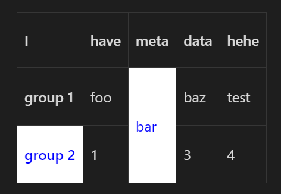

# Obsidian Sheets

This is a plugin for [Obsidian](https://obsidian.md) that brings greater functionality and usage of markdown tables.

# Features
- Merging
- Vertical table headings

# How to use

Create a normal markdown table and start using Obsidian sheets:

````md
| Just                               | a   | normal       | table |
| ---------------------------------- | --- | ------------ | ----- |
| Use `<` to merge cells to the left | <   | Merged cell! | <     |
| Use `^` to merge cells up          | <   | ^            | ^     |
````


````md
| I       | -   | also | have | vertical | headers |
| ------- | --- | ---- | ---- | -------- | ------- |
| group 1 | -   | foo  | bar  | baz      | test    |
| group 2 | -   | 1    | 2    | 3        | 4       |

````


Use the `sheet` language tag and start using Obsidian Sheets with custom css!
````md
```sheet
{
	classes: { 
		class1: { 
			"color": "blue",
		},
        class2: {
			backgroundColor: "#fff",
        }
	},
}
---
| I                 | -   | have | meta                  | data        | !!!  |
| ----------------- | --- | ---- | --------------------- | ----------- | ---- |
| group 1           | -   | foo  | bar ~ .class1 .class2 | baz         | test |
| group 2 ~ .class1 | -   | 1    | ^                     | 3 ~ .class2 | 4    |

```
````


And it works with advanced tables!

# Future functionality
- [x] Merging
- [x] Vertical headers
- [x] Cell custom styling
- [x] Automatic `advanced-table`-like formatting 