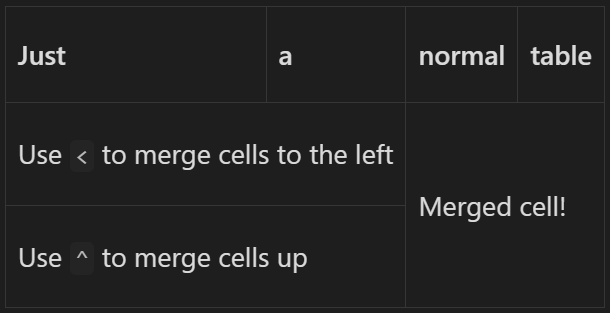
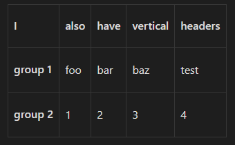
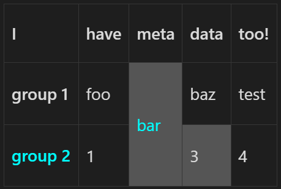
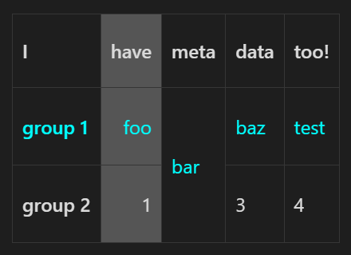
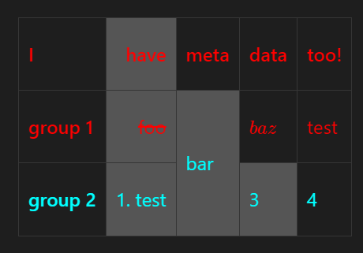
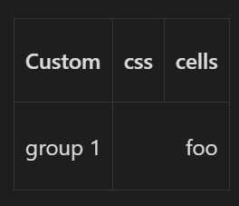

# Obsidian Sheets


This is a plugin for [Obsidian](https://obsidian.md) that brings greater functionality and usage of markdown tables.
# Features
- Cell Merging
- Vertical Table Headings
- Custom css cell styles
- Advanced Tables compatibility
# How to Use

Create a normal markdown table and start using Obsidian Sheets features:

The characters `<` and `^` in a cell will merge it with the cell to the left and above. Merged cells stack with each other, as seen below.
````md
| Just                               | a   | normal       | table |
| ---------------------------------- | --- | ------------ | ----- |
| Use `<` to merge cells to the left | <   | Merged cell! | <     |
| Use `^` to merge cells up          | <   | ^            | ^     |
````


Vertical Headers are created by making a column contain only dashes, much like how native horizontal headers are made with a row containing only dashes.   
````md
| I        | -   | have | horizontal | headers |
| -------- | --- | ---- | ---------- | ------- |
| also     | -   | foo  | bar        | <       |
| have     | -   | 1    | 2          | 3       |
| vertical | -   | A    | B          | C       |
| headers! | -   | X    | Y          | Z       |

````


And it works with Advanced Tables!

Use the `sheet` language tag and start using Obsidian Sheets with custom CSS! Partition off the class names, prefixed with a `.` using a `~` as seen below and use CSS with said class names in metadata above the table.
````md
```sheet
{
    classes: { 
        class1: { 
            "color": "cyan",
        },
        class2: {
            backgroundColor: "#555",
        }
    },
}
---
| I                 | -   | have | meta                  | data        | too! |
| ----------------- | --- | ---- | --------------------- | ----------- | ---- |
| group 1           | -   | foo  | bar ~ .class1 .class2 | baz         | test |
| group 2 ~ .class1 | -   | 1    | ^                     | 3 ~ .class2 | 4    |

```
````


Apply custom css to full rows and headers by applying custom classes to the row and column headers. Markdown table alignment with `:` is also allowed.
````md
```sheet
{
    classes: {
        c1: {
            "color": "cyan",
        },
        c2: {
            backgroundColor: "#555",
        }
    },
}

---

| I           | ----   | have     | meta       | data  | too! |
| ----------- | ----   | -: ~ .c2 | ---------- | ----- | ---- |
| group 1     | - ~.c1 | foo      | bar        | baz   | test |
| group 2     | ------ | 1        | ^          | 3     | 4    |

```
````


Apply custom styles to the entire table by using the custom styles/classes syntax on the metadata!
````md
```sheet

{
    classes: {
        c1: {
            "color": "cyan",
        },
        c2: {
            backgroundColor: "#555",
        }
    },
}

--- ~ { color: 'red' }

| I           | ----   | have     | meta                  | data        | too! |
| ------------| ------ | -: ~ .c2 | --------------------- | ----------- | ---- |
| group 1     | ----   | ~~foo~~  | bar ~ .c1 .c2         | $baz$       | test |
| group 2     | - ~.c1 | 1\. test | ^                     | 3 ~ .c2     | 4    |
```
````


You can also directly apply custom css to cells instead of defining a class
```md
| Custom  | css                             | cells |
| ------- | ------------------------------- | ----- |
| group 1 | foo ~ { "text-align": "right" } | <     |
```


# Installation
## From within Obsidian
This plugin is [now available](https://github.com/obsidianmd/obsidian-releases/pull/2281) on Obsidian community plugins under the name `Sheets Extended`.

Go to `Settings -> Community plugins -> Browse`, search for `Sheets Extended`, click `install` then `enable`.

## Manual
1. Download `main.js`, `styles.css`, and `mainfest.json` from [releases](https://github.com/NicoNekoru/obsidan-advanced-table-xt/releases)
2. Place the installed files in `<vault>/.obsidian/plugins/sheets`
3. Reload Obsidian (Open command palette and `Reload without saving`)
4. Go to `Settings -> Options -> Community Plugins` and disable safe mode
5. Enable the plugin `Sheets Extended` under `Settings -> Options -> Community Plugins -> Installed plugins`

# Future Functionality
- [x] Merging Cells
- [x] Vertical Headers
- [x] Custom Cell Styles
  - [x] Custom row and column styles
  - [x] Inline custom styles
- [x] Automatic `advanced-table`-like Formatting 
  - [x] Custom css for `advanced-table`

# Support me!
Using this plugin is completely free, but if you would like to support me or think that I have contributed value to your days you can support me here:

[](https://paypal.me/NicoNekoru)
[](https://www.buymeacoffee.com/niconekoru)