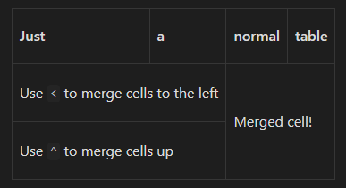

# Obsidian Sheets

This is a plugin for [Obsidian](https://obsidian.md) that brings greater functionality and usage of markdown tables.

# Features
- Merging
- Vertical table headings

# How to use

Create a normal markdown table and wrap it in a codefence with the `sheet` language tag and start using Obsidian Sheets!:

````md
```sheet
| Just                               | a   | normal       | table |
| ---------------------------------- | --- | ------------ | ----- |
| Use `<` to merge cells to the left | <   | Merged cell! | <     |
| Use `^` to merge cells up          | <   | ^            | ^     |
| ^                                  | ^   | ^            | ^     |
```
````


````md
```sheet
| I       | -   | also | have | vertical | headers |
| ------- | --- | ---- | ---- | -------- | ------- |
| group 1 | -   | foo  | bar  | baz      | test    |
| group 2 | -   | 1    | 2    | 3        | 4       |
```
````


# Future functionality
- [x] Merging
- [x] Vertical headers
- [ ] Cell custom styling
- [ ] Automatic `advanced-table`-like formatting 